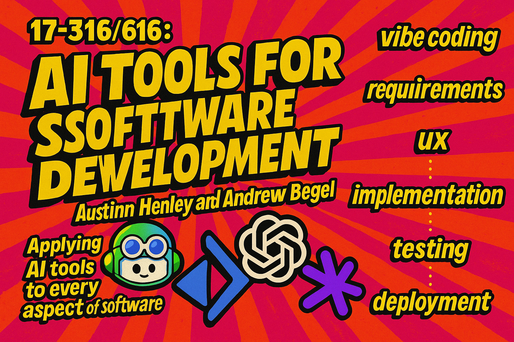

# 17-316/616: AI Tools for Software Development

Students will learn how to use AI-based developer tools across the software development lifecycle, for example in coding, code reviewing, project management, automated testing, and security. The course will require significant software development practice, both with and without AI tools. Students will use their experiences to analyze the impact of AI tools on software productivity across individuals, teams, and organizations.

## This Week



    

        Class & Readings
    

    

        
            
                

                    {{ lecture.name }}
                

                

                    calendar_month
                    {{ lecture.date }}
                

                
                <a class="label label-gold" href="{{lecture.link}}" target="_blank">
                    slideshow
                    Slides
                </a>
                

                
                    <a class="label label-blue" href="{{lecture.reading.link}}" target="_blank">
                        link
                        {{lecture.reading.name}}
                    </a>
                    
                        
                            <a class="label label-blue" href="{{lecture.reading.link2}}" target="_blank">
                            link
                                {{lecture.reading.name2}}
                            </a>
                        
                    
                
                
                

                
            
        
            None!
        
    

    

        Office Hours
    

    

        
Andrew Begel's Office Hours are in TCS 441. Austin Henley's Office Hours will be in TCS 445. See <a href="#class-calendar">class calendar</a> below for the times!

    

    

        Current Assignment
    

    

        
            

                {{ this_week.last_homework.name }}
            

            
            

                calendar_month
                {{ this_week.last_homework.deadline }}
            

            

            
            <a class="label label-red" href="{{this_week.last_homework.link}}">
                descriptionHandout
            </a>
            
        
            None for this week!
        
    

    

        Upcoming Assignments
    

    

        
            

                {{ this_week.next_homework.name }}
            

            

                calendar_month
                Released {{ this_week.next_homework.date }}
            

            
            

                calendar_month
                {{ this_week.next_homework.deadline }}
            

            

            
            <a class="label label-red" href="{{this_week.next_homework.link}}">
                descriptionHandout
            </a>
            
        
            None!
        
    

## Important Links




<a class="card" href="{{link.link}}" target="_blank">

{{ link.name }}

</a>


## Office Hours Calendar
<iframe id="class-calendar" src="https://calendar.google.com/calendar/embed?height=600&wkst=1&ctz=America%2FNew_York&showPrint=0&mode=MONTH&src=Y185Y2EyMWY0NThhNTlmMDhkNDc1ZWFlNjU4ODNkODRiYzBiM2E3ZjMwNDgxYzNlZWFjMzE3NmVkN2ZmNTQzZmFiQGdyb3VwLmNhbGVuZGFyLmdvb2dsZS5jb20&color=%23f6bf26" style="border-width:0" width="800" height="600" frameborder="0" scrolling="no"></iframe>

## Weekly Schedule

<!-- Loading in schedule from schedule.yaml -->






<table>
    <thead>
        <th><b>Date</b></th>
        <th><b>Class</b></th>
        <th><b>Reading</b></th>
        <th><b>Homework</b></th>
    </thead>
    <tbody>
        
        <tr>
            <td>{{schedule_day.date}}</td>

            <td>
                
                    
                        <a class="label label-gold" href="{{schedule_day.lecture.link}}" target="_blank">
                            {{schedule_day.lecture.name}}
                        </a>
                    
                        <b>{{schedule_day.lecture.name}}</b>
                    
                
            </td>

            <td>
                
                    <a class="label label-blue" href="{{schedule_day.reading.link}}" target="_blank">
                        {{schedule_day.reading.name}}
                    </a>
                
                
                    
                        <a class="label label-blue" href="{{schedule_day.reading.link2}}" target="_blank">
                            {{schedule_day.reading.name2}}
                        </a>
                    
                

            </td>

            
                <td rowspan="{{schedule_day.homework.numDays}}">
                    <b>{{schedule_day.homework.name}}</b>
                     
                    {{schedule_day.homework.deadline}}
                     

                    
                    <a class="label label-red" href="{{schedule_day.homework.link}}">
                        descriptionInstructions
                    </a>
                    
                </td>
                
            
                
                    
                
                    <td></td>
                
            
        </tr>
        
    </tbody>

</table>


Coming Soon!


## Staff

### Instructors




    

        
        

            <h3 class="staffer-name">
                {{instructor.name}}
            </h3>
            

                <a href="mailto:{{instructor.email}}">
                    mail
                </a>
                
                <a href="{{instructor.website}}" target="_blank">
                    public
                </a>
                
            

        

    








### Teaching Assistants



    

        
        

            <h3 class="staffer-name">
                {{assistant.name}}
            </h3>
            

                <a href="mailto:{{assistant.email}}">
                    mail
                </a>
                
                <a href="{{assistant.website}}" target="_blank">
                    public
                </a>
                
            

        

    




